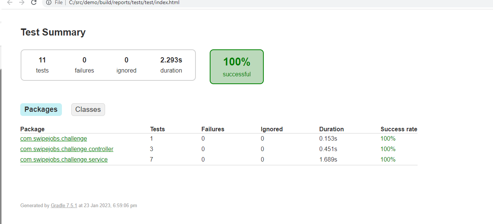
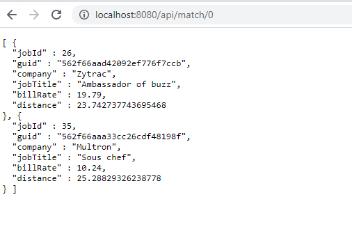
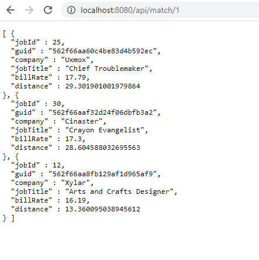

# Job Matching Service

Job matching service is a simple matching engine that presents Workers with appropriate Jobs.

It reads jobs and workers from a pre-configured source data urls and provides an endpoint /api/match/{workerId} to get a
pre-configured number of matching jobs for a worker.

## Assumptions

* Bill rate of a job is always in dollars
* Distance unit is always in kilo meters
* A worker always need to have all the required certificates

## Technical decisions

* Backend service is implemented using Micronaut
* The database used is Mongodb
* Data is bootstrapped when the application runs for the first time and successive runs does not update any records if
  the jobId or worker id already exists
* The docker-compose file in src/main/resources is used to start a mongo db container together with mongo-express
* Unit testing is done with spock
* As there was an issue with using test containers, the same database above is used for testing

## Possible improvements

* Rather than doing the filtering out of jobs by required certificates in memory, a database query will improve the
  performance
* This solution will not work in a scaled environment due to the reason above
* Using test containers will improve test performance and will be easier to maintain tests when new features are adding
* At the moment collections are automatically created on admin db (which was again due to an error) and is a good idea
  to move it to a separate database.

# Test results

# Local running

